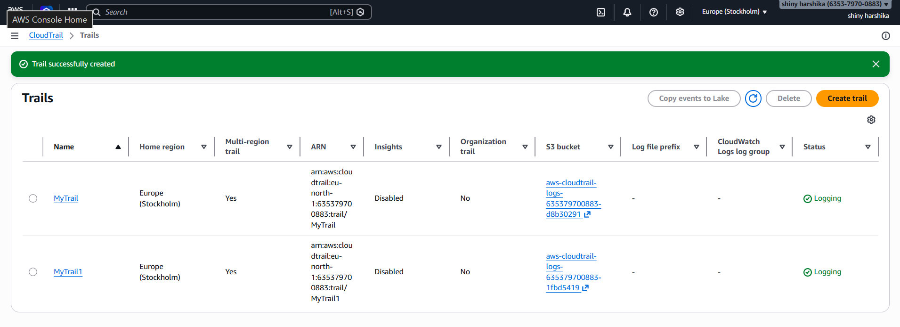

# AWS Cloud Security Monitoring Lab

## Objective

To monitor and detect suspicious activities in AWS cloud environment.

## Services Used

* AWS IAM
* CloudTrail
* GuardDuty
* S3

---

## Step 1: CloudTrail Setup

Enabled AWS CloudTrail to log all account activities across regions.

